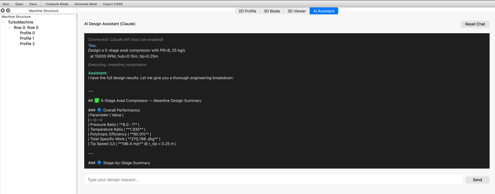
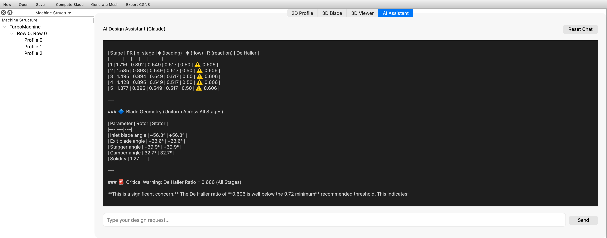
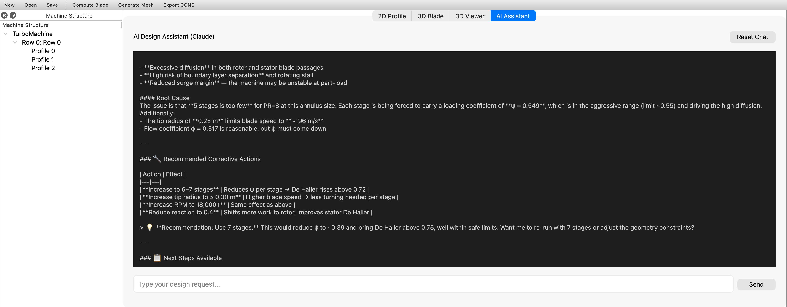

# AstraTurbo

**Open-source integrated turbomachinery design and simulation platform.**

AstraTurbo covers the full turbomachinery engineering pipeline:

```
Requirements → Meanline Design → Blade Geometry → Mesh → CFD → FEA → Optimization
                              ↑ AI Assistant (Claude) can drive the entire pipeline ↑
```

AstraTurbo is an open-source turbomachinery platform. Built with Python 3.10+, cross-platform dependencies, and a modular architecture. Runs natively on **Windows, Linux, and macOS**.

---

## Installation

```bash
git clone https://github.com/ayushman4/AstraTurbo.git
cd AstraTurbo

# Core only (design + mesh + export, no GUI)
pip install -e .

# With GUI (adds PySide6, pyqtgraph, VTK)
pip install -e ".[gui]"

# With AI assistant (adds Claude API integration)
pip install -e ".[ai]"

# Everything (adds optimization, AI, dev tools)
pip install -e ".[all]"
```

Verify:

```bash
python -m astraturbo --version
# astraturbo 0.1.0

python -m pytest tests/ -q
# 171 passed
```

---

## Three Ways to Use AstraTurbo

AstraTurbo can be used through a **GUI**, the **command line**, or the **Python API**.

---

## 1. GUI (Graphical Interface)

### Launch

```bash
python -m astraturbo gui
```

### Window Layout

```
┌─────────────┬──────────────────────────────────────────────┬──────────────┐
│  Machine    │  2D Profile / 3D Blade / 3D Viewer / AI Chat │  Properties  │
│  Structure  │  (center, tabbed)                            │  (editable   │
│  (tree)     │                                              │   fields)    │
├─────────────┴──────────────────────────────────────────────┴──────────────┤
│  Mesh Panel (cell counts, grading, quality report)                        │
└───────────────────────────────────────────────────────────────────────────┘
```

### Step-by-Step Workflow

**Step 1 — Design a 2D airfoil profile:**
1. In the **2D Profile** tab, select a **Camber** type (NACA 65, Circular Arc, Polynomial, etc.)
2. Select a **Thickness** type (NACA 4-Digit, NACA 65-Series, Joukowski, Elliptic)
3. The profile plot updates live

**Step 2 — Configure the 3D blade:**
1. Switch to the **3D Blade** tab
2. Set number of blades, angular velocity, stacking mode
3. To add more span profiles: **Edit > Add Profile to Row**

**Step 3 — Compute 3D blade geometry:**
- **Compute > Compute Blade Geometry** (or toolbar: "Compute Blade")

**Step 4 — Generate a mesh:**
1. In the **Mesh** panel (bottom), set axial cells, radial cells, grading
2. **Compute > Generate Multi-Block Mesh**
3. Quality report appears: total cells, aspect ratio, skewness

**Step 5 — Export:**
- **File > Export > CGNS Mesh** — for ParaView, CFX, Fluent
- **File > Export > OpenFOAM blockMeshDict** — for OpenFOAM
- **File > Export > VTK Mesh** — for generic visualization

**Step 6 — Import existing meshes:**
- **File > Import OpenFOAM Points** — loads and visualizes in the **3D Viewer** tab
- **File > Import Legacy XML Project** — legacy projects

**Step 7 — AI Assistant (optional):**
1. Click the **AI Assistant** tab
2. Type a natural language request, e.g. "Design a 5-stage compressor with PR=8"
3. The AI calls AstraTurbo tools automatically (API mode) or generates commands (CLI fallback)
4. Requires: `pip install anthropic` + `export ANTHROPIC_API_KEY=sk-ant-...`

### Screenshots

**AI Assistant — Meanline Design**: Ask Claude to design a compressor. It calls `meanline_compressor` automatically and returns a full engineering breakdown with overall performance:



**AI Assistant — Stage Analysis**: Stage-by-stage velocity triangles, blade angles, and De Haller ratio warnings flagged automatically:



**AI Assistant — Engineering Judgment**: The AI identifies that 5 stages is too few for PR=8 (loading too aggressive), explains the root cause, and recommends corrective actions:



**AI Assistant — Next Steps**: Offers to re-run with 7 stages, generate blade profiles, create CFD mesh, or run structural analysis — all from the same conversation:


**Keyboard shortcuts:** Cmd+N (New), Cmd+O (Open), Cmd+S (Save), Cmd+Q (Quit)

---

## 2. Command Line (CLI)

```bash
python -m astraturbo --help
```

### Generate a 2D blade profile

```bash
python -m astraturbo profile --camber naca65 --thickness naca4digit -o blade.csv
python -m astraturbo profile --camber circular_arc --thickness elliptic --plot
```

### Generate a mesh from a profile

```bash
python -m astraturbo mesh --profile blade.csv --pitch 0.05 -o mesh.cgns
python -m astraturbo mesh --profile blade.csv --pitch 0.05 --format vtk -o mesh.vtk
```

### Inspect any file

```bash
python -m astraturbo info /path/to/points          # OpenFOAM
python -m astraturbo info mesh.cgns                 # CGNS
python -m astraturbo info blade.csv                 # CSV
```

### Set up a CFD case

```bash
python -m astraturbo cfd --solver openfoam --velocity 100 -o my_case
python -m astraturbo cfd --solver fluent --velocity 120 -o fluent_case
python -m astraturbo cfd --solver cfx --rotating --omega 1500 -o cfx_case
python -m astraturbo cfd --solver su2 -o my_su2_case
```

### AI Assistant

```bash
# Interactive chat (requires ANTHROPIC_API_KEY)
python -m astraturbo ai

# Single request
python -m astraturbo ai "Design a 5-stage compressor with PR=8, mass flow 25 kg/s"
```

### Meanline design

```bash
python -m astraturbo meanline --pr 4.0 --mass-flow 20 --rpm 12000 --r-hub 0.15 --r-tip 0.30
```

### y+ calculator

```bash
python -m astraturbo yplus --velocity 100 --chord 0.1
python -m astraturbo yplus --velocity 100 --chord 0.1 --cell-height 0.00001
```

### FEA setup

```bash
python -m astraturbo fea --list-materials
python -m astraturbo fea --material inconel_718 --omega 1200 --surface blade.csv -o fea_case
```

### Other commands

```bash
python -m astraturbo formats                    # List 30 supported formats
python -m astraturbo optimize --profile blade.csv --generations 50
python -m astraturbo multistage --profiles r.csv s.csv --pitches 0.05 0.06 -o stage.cgns
python -m astraturbo run cfd_case --solver openfoam
```

### End-to-end (no GUI)

```bash
python -m astraturbo profile --camber naca65 --thickness naca4digit -o blade.csv
python -m astraturbo mesh --profile blade.csv --pitch 0.05 -o mesh.cgns
python -m astraturbo info mesh.cgns
python -m astraturbo cfd --solver openfoam --velocity 100 -o cfd_case
```

---

## 3. Python API

### Meanline design: requirements → blade angles

```python
from astraturbo.design import meanline_compressor, meanline_to_blade_parameters

# Input: top-level requirements
result = meanline_compressor(
    overall_pressure_ratio=4.0,
    mass_flow=20.0,        # kg/s
    rpm=12000,
    r_hub=0.15,            # m
    r_tip=0.30,            # m
)

print(result.summary())
# Meanline Analysis: 5 stages
#   Overall PR:   4.000
#   Stage 1: PR=1.35, phi=0.48, psi=0.38, R=0.50
#   Rotor beta: -52.1 → -38.4 deg
#   ...

# Convert to blade geometry parameters
blade_params = meanline_to_blade_parameters(result)
# [{stage: 1, rotor_stagger_deg: -45.2, rotor_camber_deg: 13.7, ...}, ...]
```

### Generate a profile

```python
from astraturbo.camberline import NACA65
from astraturbo.thickness import NACA4Digit
from astraturbo.profile import Superposition

profile = Superposition(NACA65(cl0=1.0), NACA4Digit(max_thickness=0.10))
coords = profile.as_array()  # (399, 2) array
```

### Full pipeline: profile → 3D blade → mesh → CGNS

```python
import numpy as np
from astraturbo.camberline import NACA65
from astraturbo.thickness import NACA65Series
from astraturbo.profile import Superposition
from astraturbo.blade import BladeRow
from astraturbo.mesh.multiblock import generate_blade_passage_mesh

profiles = [
    Superposition(NACA65(cl0=0.8), NACA65Series(max_thickness=0.08)),
    Superposition(NACA65(cl0=1.0), NACA65Series(max_thickness=0.10)),
    Superposition(NACA65(cl0=1.2), NACA65Series(max_thickness=0.12)),
]

row = BladeRow(
    hub_points=np.array([[0.0, 0.10], [0.10, 0.10]]),
    shroud_points=np.array([[0.0, 0.20], [0.10, 0.20]]),
)
for p in profiles:
    row.add_profile(p)
row.compute(
    stagger_angles=np.deg2rad([30, 35, 40]),
    chord_lengths=np.array([0.04, 0.05, 0.06]),
)

mesh = generate_blade_passage_mesh(
    profile=profiles[1].as_array(), pitch=0.05,
    n_blade=40, n_ogrid=10, n_inlet=15, n_outlet=15, n_passage=20,
)
mesh.export_cgns("compressor.cgns")
```

### CFD workflow (OpenFOAM, Fluent, CFX, SU2)

```python
from astraturbo.cfd import CFDWorkflow, CFDWorkflowConfig

# OpenFOAM with rotating frame
wf = CFDWorkflow(CFDWorkflowConfig(
    solver="openfoam",
    inlet_velocity=100.0,
    turbulence_model="kOmegaSST",
    is_rotating=True,
    omega=1200.0,
    n_procs=4,
))
wf.set_mesh("mesh.cgns")
wf.setup_case("cfd_case/")
# Creates: Allrun, blockMeshDict or cgnsToFoam, MRFProperties, BCs

# ANSYS Fluent journal
wf = CFDWorkflow(CFDWorkflowConfig(solver="fluent", inlet_velocity=80))
wf.set_mesh("blade.msh")
wf.setup_case("fluent_case/")
# Creates: run.jou with k-omega SST, BCs, iteration control

# ANSYS CFX definition
wf = CFDWorkflow(CFDWorkflowConfig(solver="cfx", is_rotating=True, omega=1500))
wf.setup_case("cfx_case/")
# Creates: setup.ccl with domain, turbulence, boundaries, solver control

# SU2
wf = CFDWorkflow(CFDWorkflowConfig(solver="su2"))
wf.setup_case("su2_case/")
# Creates: astraturbo.cfg, run_su2.sh
```

### FEA structural analysis

```python
from astraturbo.fea import (
    FEAWorkflow, FEAWorkflowConfig,
    get_material, list_materials,
)

# See available materials
print(list_materials())
# ['al_7075', 'cmsx_4', 'inconel_625', 'inconel_718', 'steel_17_4ph', 'ti_6al_4v']

# Set up structural analysis
fea = FEAWorkflow(FEAWorkflowConfig(
    material=get_material("inconel_718"),
    omega=1200.0,           # Centrifugal load
    blade_thickness=0.002,
    analysis_type="static", # Or "frequency" for modal analysis
))
fea.set_blade_surface(surface_points, ni, nj)
fea.set_cfd_pressure(cfd_points, cfd_pressure)  # Map CFD loads to FEA
fea.setup("fea_case/")
# Creates: blade.inp (CalculiX/Abaqus format) with:
#   - Solid hex mesh extruded from blade surface
#   - Inconel 718 material properties
#   - Centrifugal load (CENTRIF)
#   - CFD pressure mapped to surface
#   - Fixed root boundary condition
#   - Stress/displacement output requests

# Quick analytical stress estimate (no solver needed)
estimate = fea.estimate_stress_analytical()
print(f"Centrifugal stress: {estimate['centrifugal_stress_MPa']:.1f} MPa")
print(f"Safety factor: {estimate['safety_factor']:.2f}")
```

### Multi-stage rotor + stator

```python
from astraturbo.mesh.multistage import MultistageGenerator, RowMeshConfig

gen = MultistageGenerator()
gen.add_row("rotor", RowMeshConfig(profile=rotor_profile, pitch=0.05, is_rotor=True))
gen.add_row("stator", RowMeshConfig(profile=stator_profile, pitch=0.06))
result = gen.generate()
result.export_cgns("stage.cgns")
```

### Read any mesh format

```python
from astraturbo.export import read_mesh, write_mesh, read_openfoam_points

# Unified API — auto-detects format
data = read_mesh("mesh.vtk")
data = read_mesh("grid.cgns")
data = read_mesh("case.plt")       # Tecplot
data = read_mesh("mesh.ugrid")     # NASA UGRID

# Write to any format
write_mesh("output.vtu", points, cells)

# OpenFOAM points with validation
points = read_openfoam_points("/path/to/points")
```

### AI Assistant (natural language → AstraTurbo)

```python
from astraturbo.ai import create_assistant

# Requires ANTHROPIC_API_KEY environment variable
assistant = create_assistant()

# Single request — AI calls tools automatically
response = assistant.chat(
    "Design a 5-stage axial compressor with PR=8, mass flow 25 kg/s at 15000 RPM. "
    "Generate NACA 65 profiles and set up an OpenFOAM case."
)
print(response)

# Multi-turn conversation
response2 = assistant.chat("Now check what y+ I need for the first stage at Mach 0.6")
print(response2)

# Reset conversation
assistant.reset()
```

Claude calls 9 AstraTurbo tools directly —
meanline design, profile generation, mesh generation, CFD setup, FEA setup,
y+ calculator, file inspection, material database, format listing.

Setup:
```bash
pip install anthropic
export ANTHROPIC_API_KEY=sk-ant-api03-...
```

---

## Architecture

```
astraturbo/
├── ai/              Claude-powered AI assistant (9 tools, NL interface)
├── design/          Velocity triangles, meanline analysis
├── foundation/      Property system, signals, undo/redo, serialization
├── baseclass/       ATObject, Node tree, Drawable mixin
├── camberline/      8 camber line types
├── thickness/       4 thickness distributions
├── distribution/    Point sampling (Chebyshev, Linear)
├── profile/         2D airfoil construction (superposition)
├── blade/           3D blade geometry (stacking, NURBS lofting)
├── nurbs/           NURBS curves & surfaces (via geomdl)
├── machine/         TurboMachine container, project management
├── mesh/            Mesh generation:
│   ├── transfinite    TFI with grading
│   ├── scm_mesher     S2m meridional plane mesh
│   ├── ogrid/         O10H topology O-grid around blades
│   ├── polyline       Polyline/Arc edge geometry
│   ├── grading        Edge grading projection onto curves
│   ├── vertex_extraction  Block topology from profiles
│   ├── multiblock     Multi-block structured mesher (GridZ replacement)
│   ├── multistage     Rotor+stator multi-row orchestration
│   └── quality        Aspect ratio, skewness, y+ estimation
├── export/          30 formats: CGNS, OpenFOAM, Tecplot, VTK, Fluent, etc.
├── cfd/             4 solvers: OpenFOAM, Fluent, CFX, SU2
├── fea/             Structural analysis: CalculiX/Abaqus
│   ├── material       6 turbomachinery materials database
│   ├── calculix       Input file generation
│   ├── mesh_export    Surface-to-solid mesh, CFD pressure mapping
│   └── workflow       Coupled CFD-FEA pipeline
├── optimization/    pymoo-based multi-objective optimization
├── gui/             PySide6 GUI with 3D viewer + AI chat panel
└── cli/             13 commands (profile, mesh, ai, meanline, cfd, fea, ...)
```

### Design pipeline

```
┌────────────┐    ┌──────────┐    ┌──────────┐    ┌──────────┐    ┌──────────┐    ┌──────────┐
│  Meanline  │───▶│ Geometry │───▶│   Mesh   │───▶│   CFD    │───▶│   FEA    │───▶│ Optimize │
│  Design    │    │          │    │          │    │          │    │          │    │          │
│            │    │ Stacking │    │  O-Grid  │    │ OpenFOAM │    │ CalculiX │    │  pymoo   │
│ Vel. tri.  │    │  NURBS   │    │   TFI    │    │ Fluent   │    │ Abaqus   │    │  NSGA-II │
│ Euler eqn  │    │Hub/Shroud│    │Multi-blk │    │ CFX      │    │Materials │    │  DOE     │
│ Blade      │    │          │    │  CGNS    │    │ SU2      │    │Stress/   │    │          │
│ angles     │    │          │    │          │    │          │    │ modal    │    │          │
└────────────┘    └──────────┘    └──────────┘    └──────────┘    └──────────┘    └──────────┘
      │                                                                                │
      └────────────────────────── Optimization Loop ───────────────────────────────────┘
```

---

## Supported File Formats (30)

### Geometry & CAD

| Format | Extensions | Read | Write | Method |
|---|---|---|---|---|
| STEP | .step, .stp | - | Yes | cadquery (optional) |
| IGES | .iges, .igs | - | Yes | cadquery (optional) |
| STL | .stl | Yes | Yes | Native + meshio |
| OBJ | .obj | Yes | Yes | meshio |
| PLY | .ply | Yes | Yes | meshio |

### Mesh Formats

| Format | Extensions | Read | Write | Method |
|---|---|---|---|---|
| CGNS | .cgns | Yes | Yes | Native (h5py) |
| OpenFOAM points | points | Yes | - | Native |
| OpenFOAM blockMeshDict | blockMeshDict | - | Yes | Native |
| PLOT3D | .xyz, .p3d, .q | Yes | Yes | Native |
| Tecplot | .plt, .dat, .tec | Yes | Yes | Native |
| Gmsh | .msh | Yes | Yes | meshio |
| UNV (I-DEAS) | .unv | Yes | Yes | meshio |
| Nastran | .nas, .bdf | Yes | Yes | meshio |
| ANSYS Fluent | .cas, .msh | Yes | Yes | meshio |
| SU2 | .su2 | Yes | Yes | meshio |
| UGRID (NASA) | .ugrid | Yes | - | Native |
| Abaqus / CalculiX | .inp | Yes | Yes | meshio + Native |

### Visualization & Solver I/O

| Format | Extensions | Read | Write | Method |
|---|---|---|---|---|
| VTK / VTU / PVTU | .vtk, .vtu | Yes | Yes | meshio |
| EnSight Gold | .case | Yes | - | Native + meshio |
| XDMF + HDF5 | .xdmf | Yes | Yes | meshio |
| HDF5 (generic) | .h5, .hdf5 | Yes | - | Native (h5py) |
| Exodus II | .exo | Yes | Yes | meshio |

### Unified API

```python
from astraturbo.export import read_mesh, write_mesh
data = read_mesh("any_file.vtk")  # Auto-detect format
write_mesh("output.su2", points, cells)
```

---

## Material Database

6 turbomachinery materials with full mechanical + thermal properties:

| Material | Density | E (GPa) | Yield (MPa) | Max Temp (K) | Use Case |
|---|---|---|---|---|---|
| Inconel 718 | 8190 | 200 | 1035 | 973 | HP compressor, LP turbine |
| Inconel 625 | 8440 | 205 | 758 | 1073 | Combustor, exhaust |
| Ti-6Al-4V | 4430 | 114 | 880 | 673 | Fan, LP compressor |
| CMSX-4 | 8700 | 130 | 950 | 1373 | HP turbine (single crystal) |
| Steel 17-4PH | 7780 | 197 | 1170 | 623 | Structural components |
| Al 7075-T6 | 2810 | 72 | 503 | 473 | Low-temp components |

```python
from astraturbo.fea import get_material, list_materials
mat = get_material("inconel_718")
print(mat.to_calculix_format())  # Ready for FEA input
```

---

## Dependencies

| Dependency | Purpose | Required? |
|---|---|---|
| numpy, scipy | Numerics | Yes |
| geomdl | NURBS curves/surfaces | Yes |
| h5py | CGNS + HDF5 read/write | Yes |
| meshio | 20+ mesh formats | Yes |
| pyyaml | Project file format | Yes |
| blinker | Signal/event system | Yes |
| PySide6 | GUI framework | Optional (`[gui]`) |
| pyqtgraph | 2D/3D plotting in GUI | Optional (`[gui]`) |
| vtk | 3D visualization | Optional (`[gui]`) |
| pymoo | Multi-objective optimization | Optional (`[optimization]`) |
| anthropic | Claude AI assistant | Optional (`[ai]`) |
| cadquery | STEP/IGES CAD export | Optional (`[cad]`) |
| matplotlib | CLI profile plotting (`--plot`) | Optional |

All cross-platform (Windows, Linux, macOS).

---

## Running Tests

```bash
pip install -e ".[dev]"
pytest tests/ -v
# 171 tests pass
```

---

## License

Apache-2.0
